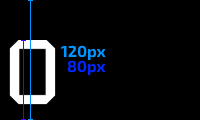

# Creating Non-Pulsating Combo Numbers

This guide will teach you how to convert combo numbers into non-pulsating ones. You should know what SD and HD images are, if you don't, please read [this part](https://rockroller01.github.io/skinninginfo/tutorial/introduction#hdsd-elements-aspect-ratios-and-resolution) of the skinning tutorial.

If you do not know what non-pulsating combo numbers are I recommend you to watch [this short 22 seconds video](https://www.youtube.com/watch?v=_vJ0_PItNWM). The benefit of non-pulsating combo numbers is obvious, you don't get the expansion animation of the combo numbers, leaving you with less clutter. However, there are a few drawbacks:

-   On background-dim levels below 100% you will still be able to kind of see the pulsating still, but instead of the numbers you will see a black box pulsating. It is recommended to only use this gimmick with 100% background-dim.
-   This gimmick is not compatible with skins that cover multiple game modes. You can only use this if your skin is for standard only.
-   Works best on short maps, since a 4 digit combo number may break this gimmick. If it breaks or not depends on your specific set of numbers.

---

1. Go to the skin.ini and set `ComboPrefix: combo` under `[Fonts]`
2. Make normal combo numbers with the prefix `combo-`
3. Adjust `ComboOverlap:` like you normally would
4. You need about 5 px (SD)/10 px (HD) to the left of the number

4. Now you need to measure the height of your number from the bottom of the canvas to the last pixel of the number, as shown on the image below by the dark blue line.

5. Expand the canvas height to 1.5 times the height you measured, as shown by the light blue line.
6. Measure the width from the left canvas border to the rightmost pixel of the number and expand the canvas width to the measured number time 4.
7. Add a black layer behind your number.
8. Expand the canvas of your other 9 numbers to the same canvas size as the first number and add a black layer behind each of them.
9. Go into the skin.ini and add to your `ComboOverlap:` the amount of pixels you added to the canvases. Make sure to divide the amount you added by 2 if you edited HD numbers!
10. Reload your skin by pressing `CTRL`+`SHIFT`+`ALT`+`S` or restarting the client and you should have non-pulsating combo numbers.
