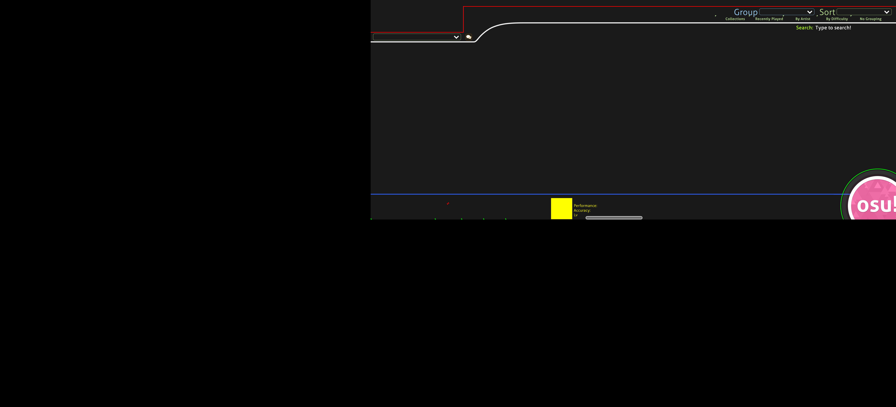

# Song Selection Template

These templates are for HD skinning and for 16:9 and 16:10 aspect ratios. Only fixed elements are on this template. Elements like the Accuracy, PP and rank are not on here, since those are changing elements. The red line at the top represent the part that is taken up by the metadata of the beatmap. The osu! logo is in its normal state, while the green outline shows the maximum size of its extended/hover state.
The anchor points of elements are marked by the differently coloured corners

-   bright red: `mode-x-small`
-   bright green (in order): `menu-back`, `selection-mode`, `selection-mods`, `selection-random`, `selection-options` and the `-over` images
-   light green: `selection-tab`
-   second image is the template aligned onto mode-osu-small, brown being the part on screen, black being offscreen

16:9

 

16:10

 

21:9

This is based on 1440p 21:9, 21:9 based on 1080p is slightly thinner.

