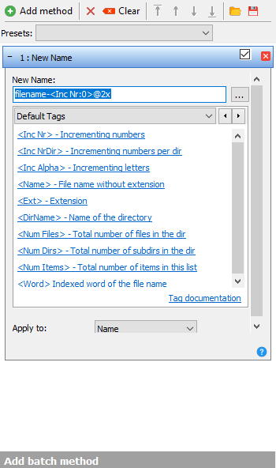

# Animations

First of all there are 2 things you will need, an animation program and a bulk renamer. For the animation program it is important that it can export as a png sequence. Common ones are:

-   Adobe PhotoShop
-   Adobe AfterEffects
-   Adobe Flash
-   Adobe Premier
-   Blender
-   3ds max

As for bulk renamers, the common ones are:

-   [Advanced Renamer](https://www.advancedrenamer.com/)
-   [Bulk Rename Utility](https://www.bulkrenameutility.co.uk/)

I personally recommend Advanced Renamer, due to its simplicity and I will use it for the rest of this tutorial.

There is a long list of files which can be animated, too many to list them all here, so please refer to the [skinnable files list](https://osu.ppy.sh/community/forums/topics/186787). It will also point out if they don't loop or have other special cases to them.

There is only two things you need to really know about, the naming and the skin.ini command `AnimationFramerate:`.

`AnimationFramerate:` accepts any positive integer aka every positive full number. The value defines how many frames of your animation should be played per second. If you for example have 60 frames for your animation and `AnimationFramerate: 15` in your skin.ini it will take four seconds to play the animation. If you do not set the framerate in the skin.ini osu! will default to playing all frames you have per second. Do note that this will affect **all** animations in your skin, so be sure that you have made all of them with the same framerate in mind.

Most files follow the naming schemes of `filename-framenumber`, where framenumber starts counting from 0. For example `menu-back-0`, `menu-back-1` ... `menu-back-10`. Do note that the sliderball and the 4 different kinds of pippidon do not have a `-` in front of the framenumber.

I once again will not and can not tell you how to make a specific animation, for that look up animation tutorials for your specific program. What I will point out however is that you should **not** make 60FPS animations. The maximum you should aim for is 30FPS and you should also make sure that your animations loop after the shortest amount of frames possible and don't take like 1200 frames to loop. Having a lot of frames introduces heavy performance issues, especially on lower end systems, not to mention it also heavily increases the filesize of the skin overall. Once you have made your animation export it as a png-sequence. You may notice however that the filename will be e.g. `menu-back-001@2x`, with two zeros too much. This is where the bulk renamer comes into play.
As previously mentioned I will explain how to do this in Advanced Renamer. First go to program > settings > renaming and un-tick `Use Zero padding in Inc Nr tags`. After you have done this add all the frames to the rename queue. Remove any method shown on the left of the menu and at the bottom under "Add batch method" select "New Name" and use `filename-<Inc Nr:0>@2x`, where filename is the name of the file you are skinning, for example `menu-back-<Inc Nr:0>@2x`. It should show in the column named "New Filename" the filename after renaming, if everything is good to go hit "Start Batch".
