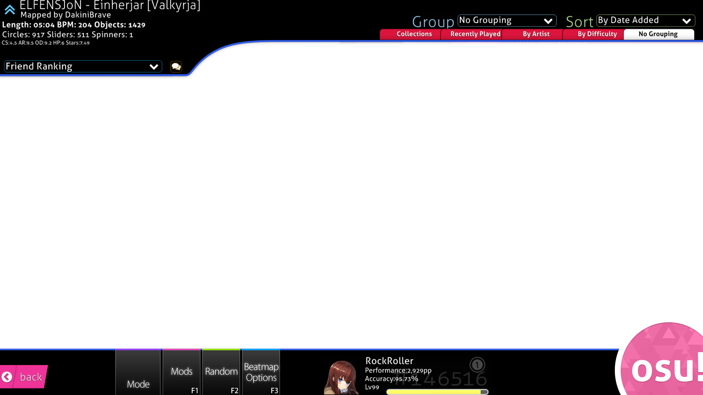
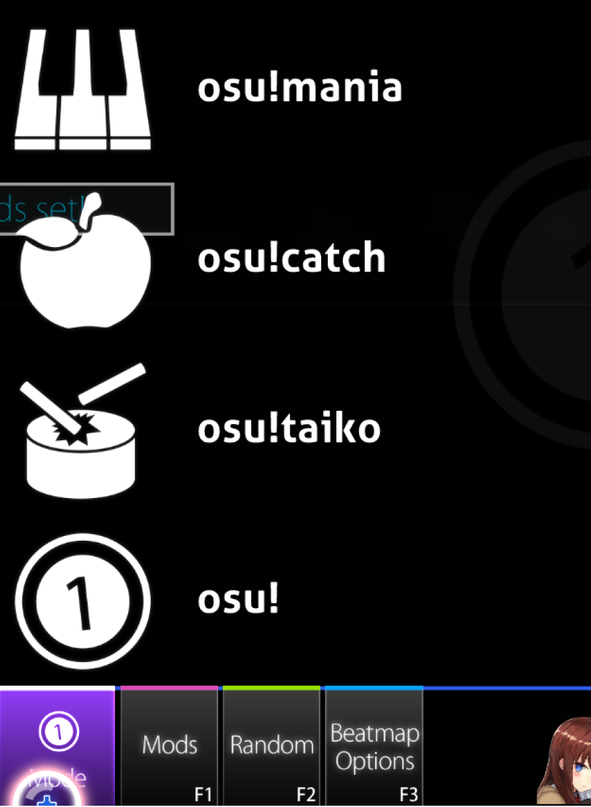
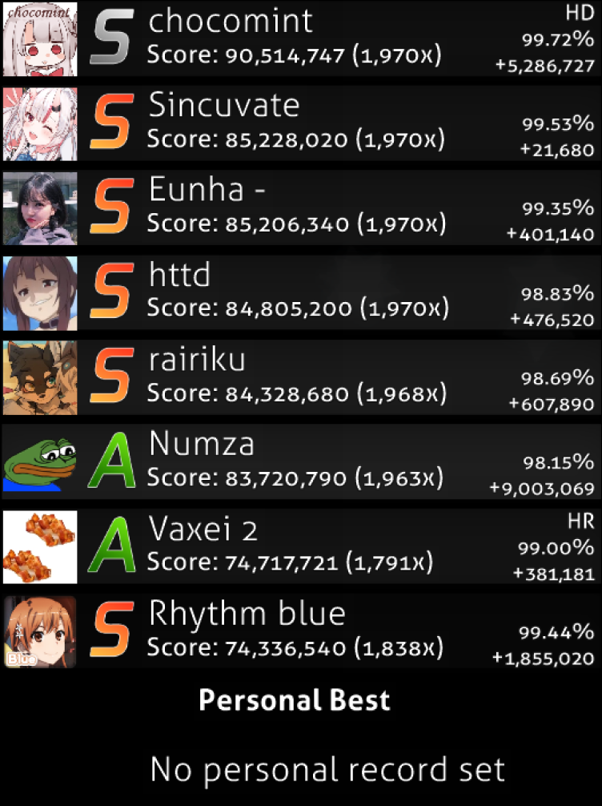
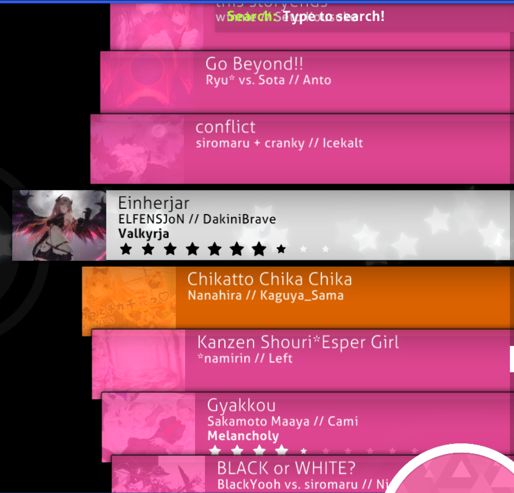
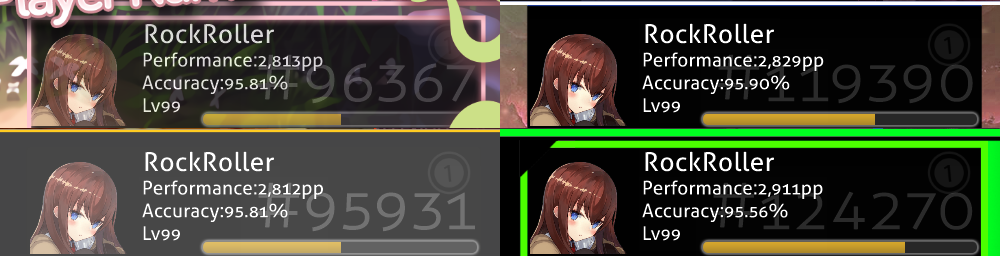
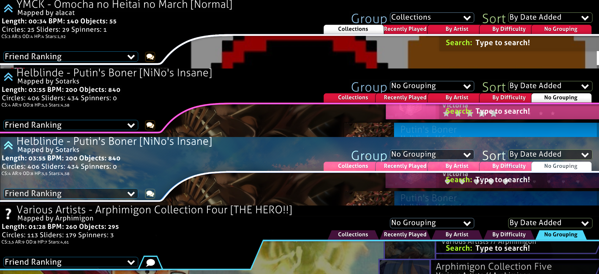
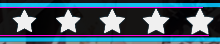
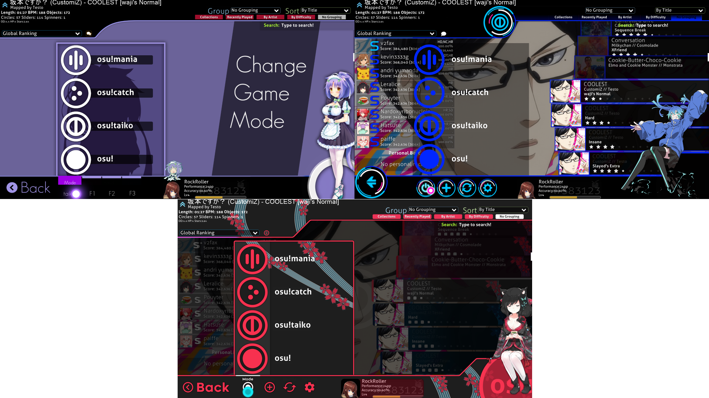

# Song Selection

Again, you can start skinning wherever you want to. Most people start with whatever they've got an idea for, which would be gameplay or the song selection in most cases. I will begin with the song selection, because it is a major part of any skin, which will also have a huge impact on the overall feel.

It's made out of several parts, which are:

Top and Bottom Part

Mode Selection

Leaderboard

Song Carousel

# Bottom Part

Let us start with the bottom part. It consists out of the following images:

-   `menu-back@2x.png`
-   `selection-mode@2x.png`, `selection-mods@2x.png`, `selection-random@2x.png`, `selection-options@2x.png`
-   `selection-mode-over@2x.png`, `selection-mods-over@2x.png`, `selection-random-over@2x.png`, `selection-options-over@2x.png`
-   `mode-osu-small@2x.png`, `mode-fruits-small@2x.png`, `mode-taiko-small@2x.png`, `mode-mania-small@2x.png`

But what do they all do?
`menu-back` and `selection-mode/mods/random/options` are the buttons on the left, the `-over` images are the ones that get shown when you hover over the buttons (although, the back button doesn't have one, it only gets a bit brighter) and the `mode-osu/fruits/taiko/mania-small` images are the small mode indicators, shown on top of `selection-mode`.
There are many ways of designing the song selection, it's totally up to you. Generally though, there are 4 main ways of shaping the bottom part.

There aren't that many things you need to know to get either of these 4 results.
Whenever you work with the song selection, [this template](https://tutorial.skinship.xyz/resources/song_selection) will be of huge help. On there is everything that the song selection contains, with its standard sizes. You basically just need to trace over it, and then, after you're finished, cut everything into their respective images.

There are a few things you can do with the bottom part that goes beyond the intended image sizes. The two main things are a height change and a shape change. The default bottom part is only 180px high, but you can make it higher. All of the buttons have their anchor points at their bottom left corner, meaning they can be extended all the way up to the upper screen border. **But**, there are two things you need to be aware of when doing this. First, if you go too high you might cover the leaderboards or beatmaps. You can extend the bottom part up to roughly ~220px (shown on the right, 5th row), without covering anything.

You could also only have certain parts go above 180px, especially in the middle of the screen, that space is more or less empty anyway.

The second thing you need to look out for are hitboxes. The hitbox of the buttons is defined by the size of their `-over` images, meaning it won't be a problem for `selection-mode/mods/random/options`, but `menu-back` doesn't have an `-over` image. The hitbox of it is defined by the size of the button itself. This is the reason why you can't make it too big, because then you might not be able to click your own topscore on the leaderboard. (The maximum size for menu-back (HD) that I would recommend is something around 220px x 500px)

The other thing I mentioned that you can do with the bottom part was changing the shape. This is basically just the same thing as a height increase, you just increase it only in certain parts.

There are just 3 other things I want to talk about regarding the bottom part. Icons, text and the userprofile. One of the most important things for the icons and the text is consistency. You often see people use icons with different styles and differently sizes. You should always use the same size for all of your icons, and if you use a round or square-ish design for them, use that design for all of them. It's bad design when three icons are one style and the fourth one has a different style. You also should keep their spacing consistent. And if the icons use a lot of lines/curves you use should use roughly the same line thickness. If they are thicker or smaller it will feel unbalanced overall.

The same goes for text: never use different text sizes. People often use different sizes to fit the text for buttons with longer names (e.g. options and random). You should rather try to either make all of the text small or abbreviate random and options. Common abbreviations are OPT, OPTN, OPTS and RAND, RND, RNDM. Other abbreviations should be fine, as long as it's clear what they mean.

**Note:** This obviously doesn't only hold true for the bottom part, these are some general design guidelines you should follow. I will not mention this again for the other parts of tutorial, please keep it in mind.

So the last thing regarding the bottom part should be the user profile. There are two things that I want to talk about. The elements of it and the outline. There are a few options to chose from here. Some people just make a cut-out and leave it like it is, but that can look a bit lazy. There are nicer ways to work with the user profile. You should either add some sort of transition to the edge, a proper border or make it look seamless. You can just add some transparency onto the part with the user profile. Not great, but still better than nothing. A nice border or a seamless blend would be the best. For the seamless blend I used transparency. The part with the user profile actually is highly transparent white. But thanks to the transparency it looks like light grey, this also works colours other than grey.

For the elements you simply have to cover the default ones. This allows you to add a tint to the levelbar by using a transparent colour, reshape the profile image and covering up the default text. When you cover up the text you just have to make sure to leave enough space for 100.00% accuracy, PP amounts over 10000 and levels over 99.

# Top part

Now onto the top part. This one often is a bigger problem for beginners, but it shouldn't be that hard to understand if you read carefully. The top part only has one editable file, `selection-tab@2x`, which is used for the sorting tabs you can see in the top right with the grouping/sorting options. They get tinted red when they are inactive and white when they are active, while the text gets tinted white while being inactive and black while being active. If you want to blank them out do not make them 1 x 1 pixels big, their size defines the hitbox. Also, if your selection-tab is black or completely transparent, the text on it will not be visible while its selected. There are 3 main things you can do with the top part:

You can colour the outline, you can add a background and you can change the shape. The top part isn't directly editable, the file for it is not skinnable. Meaning we will need a workaround. To change the colour of the outline and add a background all we need is the `mode-x-small` elements (abbreviation for mode-osu-small, mode-fruits-small, mode-taiko-small, mode-mania-small). The important factor is that it is in additive blend mode and doesn't have a size restriction.

To change the colour we basically only need to do a small subtraction to get the colour we want (or at least the closest one to it). All you need to do to change the colour of the topline is to take [this file](https://raw.githubusercontent.com/RockRoller01/skinninginfo/master/tutorial/img/song_selection/toppart_outline.png and change its colour. You can't however change it to directly the colour you want the line to be. The blend mode of the `mode-x-small` images comes into play here. Due to the additive blend mode it's colour values will always be added onto the top line instead of just covering it. This results in a limitation regarding the colour the top line can be. Any colour that has lower RGB values than the blue of the line (which is 49, 94, 237) can not be achieved. To the right is a quick overview of the colours that can be achieved.

To get the right colour for the file you just need to calculate the colours the file needs:

-   R = R(of the colour you want to archive) - 49
-   G = G(of the colour you want to archive) - 94
-   B = B(of the colour you want to archive) - 237

If you get a negative value it means that you can not get a perfect fit. You, however, just calculated the nearest possible result. You just need replace the negative values with 0.
If you want, for example, a light blue colour (78, 216, 247) the top bar should use a dark green (29, 122, 10). If you want a red colour (247, 49, 79) you will not be able to get that exact red, the best result would be a dark pink (198, 0, 158) that would result in this pink in-game:

The next thing would be to add a background to the `mode-x-small`. This isn't that hard, all you need to do is to have your layer with the outline and below it a layer with the background. We don't really have any restrictions for the background, thanks to the background of the default top part being black. There are however a few things you should look out for. If the background is too bright you will have a hard time reading any of the song information.

To counter this you either will have to choose something else for the background, or you could darken the areas where the song information is.

The last basic thing we can do with the top part is to change its shape. The only two elements that cover the whole screen are `menu-back` and `mode-x-small`. The problem with the `mode-x-smalls` is that they are in additive blend mode, they won't be able to cover the top part properly, but we will be still using them for something else. And menu-back's hitbox is defined by it's size, so if you made it cover the whole screen, the whole screen will become the back button. The element we will use is `selection-mode`. It is placed 448px (HD) from the left screen border, meaning we will only be able to form the shape from the 449th pixel onward. `Selection-mode` should only contain a black shape, while the actual image is on `mode-osu-small`. If we would not do it like this it would be near impossible to properly line up the two files with each other due to how osu!s rendering works.
`Mode-osu-small` also allows us to cover those leftmost 448 pixels, but we still have the same colour limitations as mentioned earlier.
The easiest way to explain this is to simply show what we will do with the file.

Note that if you don't want to reshape and just want to colour your outline with a colour that is not compatible you can cover the line with `selection-mode`, this will make it so that the line from pixel 449 onwards will be black, meaning you can achieve any colour you want. Just add a blend from whatever colour you have on the leftmost 448 pixels of the line into the colour you have on the rest of the outline. The beatmap info icon gets covered by this, leaving you with the opportunity to add your own.

You might've noticed that the black part that covers the shape doesn't reach all the way to the top. There is a reason for that, if you make it higher you will cover the map info.

There are a a few gimmicky things you can do with the top part, custom selection-tabs, custom search bar, good luck dropdown texts and changing or covering the group and sort text.

Covering the group and sort text is really easy. You just need selection-mode@2x for it. You have to cover the text. You will have the same problems as with changing the top part shape, covering information. If you make the cover to high it will cover longer song names. Just cut it of as shown on the example for reshaping. If you also want to replace the text and not just cover it up, just put the new text or icon onto `mode-osu-small@2x`. The one thing you need to be wary of is that this will break on different languages, because they have longer/shorter words for group/sort.

Custom selection tabs work the same way basically. Just cover the ones that already exist and put your own ones and your own text onto `mode-osu-small`. The main point of this is that you can change the text and box colour with this and use selection-tab styles that normally wouldn't be possible. You can just make the actual selection-tab a black/completely transparent box, but don't make it a 1x1 px blank image. As I already mentioned previously, the hitbox of `selection-tab` is defined by its size. The alignment for where you need to place your selection tabs can be found on the song selection template.

The search bar works the same way as the other gimmicks, cover up the default and put your own onto `mode-osu-small`. The things you have to look out for is that **Type to search!** is on top of `selection-mode`, meaning it can't be covered up. The other thing is that the box that is normally around the searchbar expands once you type anything in it. So make sure that your design is big enough to cover up the extended state of the search bar.

You may have noticed that if you skin the top part that it will drop down if you enter a beatmap. It sadly is not possible to disable it, but it also allows us to add things like "Good Luck!" to the dropdown. You need to extend the canvas by the same amount at the top and the bottom and then you can simply add a that "Good Luck!" text, or whatever else you want to add, outside of the part that is shown on the song selection. On the song selection template the brown part is the exact size of the screen, meaning you need to go above the brown part.

# Song Carousel and Leaderboard

There isn't that much that I need to say about these two parts. The carousel mainly consists out of `menu-button-background@2x.png`, `star@2x.png` and 2 ini commands under `[Colours]`. With the ini commands you can set the colour of the text on menu-button-background. `SongSelectActiveText` sets the colour for the currently selected card, `SongSelectInactiveText` sets the colour for all the non selected cards.
There are a few things you should know before you start making your song carousel:

-   The cards in the carousel get tinted in various colours. This feature sadly cannot be disabled. These colours are all on the skinnable files spreadsheet. Basically, the only way to somewhat work around this is to use mainly black and dark greys for the `menu-button-background`, this however doesn't work that well with really colourful themes. You will have to try out yourself if a black one or a colourful one will fit your theme better.
-   The thumbnail is placed 17px away from the left border of the image. The thumbnail is about 227 x 170 pixel big.
-   The stars will get slightly bigger the more there are.

      

-   If you plan to add a box around the stars, you need to be aware of the stars shifting. If you have a rank on it or if the map is for another game mode, the stars will be shifted to the right. So you need to leave space for 11 stars.

      

    

-   Stars used to have a different behaviour. They used to get partially filled. This however was changed with skin.ini version `2.2`, which brought us thumbnail support. As such you cannot have thumbnail images and the old star behaviour.
-   Everything gets shifted to the left edge if there is no thumbnail. It's recommend to include a version of the menu-button-background in an extra folder inside your skin that does not have a window for the thumbnail, because there are people who disabled thumbnails in the osu settings.

There isn't a lot you can do with the leaderboard. And for some reason, the leaderboard does not use scoreentry numbers for it's numbers. Basically the only thing you can do is to add a frame or background around the whole leaderboard. Like this:

You can do this by adding it onto mode-osu-small. the placement can be found on the song selection template.

`Mode-Osu@2x` (and mode-fruits, -taiko and -mania) can be found between the leaderboard and the song carousel. It shows the current game mode you are playing. Most people either blank it out or leave it as it is. But there are some gimmicky things that can be done with it. The aforementioned frame on the leaderboard can be done with it as well and you can add some background effects to the song selection.

The last thing I need to mention are the small ranking letters. They get shared between the song carousel and the leaderboard. They have different anchor points on both. If your font isn't monospaced (fixed-width) it can be a real nightmare to align them properly, because if you align them to the letters to the left, they will look weird on the leaderboard. But the opposite can happen if you align them to the centre. That is one of the reason why I would recommend a monospaced font for the ranking letters.

# Mode Selection

There are three main styles for the mode selection. Icons only, complete box and fullscreen, or a combination of those. You can also live some sort of window in the mode-selection, since the 4 options will get tinted purple when hovered over, which would be visible trough some sort of window.

There are two ways of skinning the mode selection. You can split it all up into their files or blank out three of them and use one for everything. The four files are `mode-osu-med`, `mode-fruits-med`, `mode-mania-med` and `mode-taiko-med`.
I recommend using this template, made by [Galvit](https://osu.ppy.sh/users/7629682) if you plan to go with only one file.

